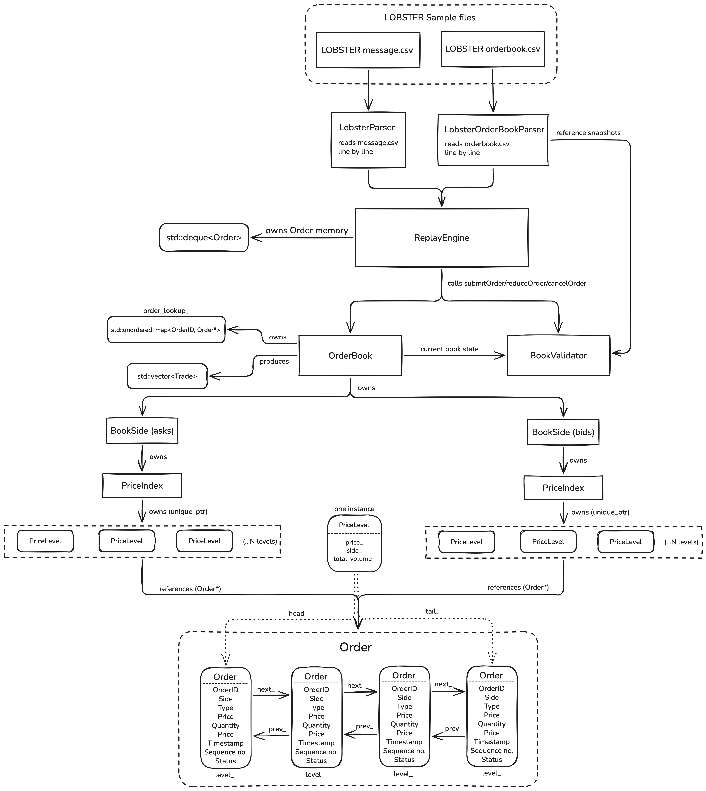

# Mercury

**A price-time-priority limit order book matching engine built in C++20 and benchmarked on real NASDAQ order flow.**

Mercury is a price-time-priority limit order book and matching engine built in C++20. It can replay historical NASDAQ TotalView-ITCH order flow distributed through the LOBSTER dataset, enabling correctness testing and latency measurement on real market activity rather than synthetic workloads.

Rather than evaluating correctness only through synthetic test cases, Mercury replays historical market events from the LOBSTER dataset and provides tooling for comparing reconstructed book states against LOBSTER reference snapshots. The project emphasizes low-latency data structures, explicit memory ownership, strong type safety, and measurable performance.

## System Architecture



## Performance Snapshot (Apple Silicon)

### Replay Throughput

| Dataset | Events | Throughput |
|---------|--------|------------|
| AAPL 2012 L1 | 118,497 | 1.75 M events/sec |
| AAPL 2012 L5 | 301,587 | 2.20 M events/sec |

### AAPL 2012 L1 dataset

| Operation | p50 | p90 | p99 |
|-----------|-----|-----|-----|
| Submit | 83 ns | 250 ns | 584 ns |
| Cancel | 42 ns | 84 ns | 250 ns |
| Reduce | 41 ns | 42 ns | 125 ns |

### AAPL 2012 L5 dataset

| Operation | p50 | p90 | p99 |
|-----------|-----|-----|-----|
| Submit | 42 ns | 208 ns | 375 ns |
| Cancel | 42 ns | 125 ns | 250 ns |
| Reduce | below timer resolution | 42 ns | 83 ns |

(Benchmarks were collected using `tools/latency_report` on Release builds and replayed against historical LOBSTER order flow.)

### Benchmark Environment

| Component | Value |
|------------|---------|
| Machine | Apple MacBook Air (M4) |
| Memory | 16 GB |
| OS | macOS 26.5.2 |
| Architecture | arm64 |
| Compiler | Apple Clang 21 |
| Build | Release (-O3) |

## Build & Run

### Prerequisites 
- C++20 compatible compiler
- CMake 
- Git

### Build 
```bash
cmake -S . -B build_release -DCMAKE_BUILD_TYPE=Release
cmake --build build_release
```

### Run Tests 
Run the complete GoogleTest suite :
```` bash
ctest --test-dir build_release --output-on-failure
````
To run Latency Benchmarks :
```` bash
./build_release/latency_report path/to/message.csv
````

## Why this project

Most "limit order book" projects stop at correctness against self-written test cases. Mercury goes further in three specific ways:

1. **Replay on real market data :** Mercury processes historical NASDAQ TotalView-ITCH events from the LOBSTER dataset, allowing correctness checks and performance measurements on real order flow rather than synthetic scenarios (Read `data/README.md` for more information regarding validation).
2. **Measured, not assumed :** Every performance claim in this README is backed by a real, reproducible measurement (`tools/latency_report`), not a theoretical complexity argument.
3. **Documented with reasoning, not just description.** Every non-trivial design decision like why a sorted vector instead of `std::map`, why two distinct numeric types (`Quantity` vs `Volume`), why copy/move are deleted on `Order`, etc are written down with the trade-off considered and why they were resolved the way they were. See `docs/`.

## Architecture 

Mercury is organized as a strict layered hierarchy - each layer knows only what it needs to, nothing more :

```text
LOBSTER Data Files
(message + orderbook)

        |
        v

LobsterParser / LobsterOrderbookParser
(raw CSV -> typed events)

        |
        v

ReplayEngine
- assigns sequence numbers
- owns order memory
- tracks unsupported event types
- records latency metrics

        |
        v

OrderBook
- price-time-priority matching

├── BookSide (bids)
│   └── PriceIndex
│
└── BookSide (asks)
    └── PriceIndex

PriceIndex
- sorted price-level index
- binary-search lookup

PriceLevel
- price-level metadata
- intrusive FIFO list of resting orders

Order
- immutable identity
- mutable execution state
```

## Optimization Case Study : Intrusive Price Levels

Early versions of Mercury stored resting orders inside each `PriceLevel` using std::list<Order*>. While functionally correct, this design required a separate heap allocation for every list node and introduced additional pointer indirection during matching and cancellation.

To improve cache locality and eliminate per-node allocation overhead, the implementation was replaced with an intrusive doubly linked structure, where the linkage pointers are stored directly inside each `Order`.

### Measured Impact (Release Build)
Benchmarks were run on the same Benchmark Environment before and after the change.

| Metric | std::list | Intrusive List | Improvement |
| ------ | -------- | ---------- | --------- |
| Submit (L1 p50) | 125 ns | 83 ns | 33.6% faster |
| Submit (L5 p50) | 125 ns | 42 ns | 66.4% faster |
| Cancel (L1 p50) | 83 ns | 42 ns | 49.4% faster |
| Cancel (L5 p50) | 83 ns | 42 ns | 49.4% faster |
| Submit (L1 p99) | 1084 ns | 584 ns | 46.1% faster |
| Submit (L5 p99) | 1042 ns | 375 ns | 64.0% faster |

This optimization preserved O(1) order removal while significantly reducing latency and memory-management overhead.

## Data & Validation

Mercury includes tooling to replay LOBSTER message files and compare the
reconstructed order book against the corresponding LOBSTER reference
snapshots.

The replay infrastructure has been tested using miniature fixtures as well
as real LOBSTER datasets containing 118K+ L1 events and 301K+ L5 events.

### Why full book-state validation currently produces mismatches

LOBSTER distributes reconstructed order-book snapshots together with a filtered message stream. The supplied message stream does not necessarily contain the complete lifecycle of every order present in the initial book.

As a result, the replay can encounter events such as cancellations or executions for orders that were already active before the supplied message
window began. Mercury cannot reconstruct an order that it has never received a submission event for.

This creates a boundary-condition problem:

1. An order exists in the LOBSTER reference book at the beginning of the
   supplied dataset.
2. Its original submission event occurred outside the supplied message
   window.
3. Mercury therefore does not have that order in its reconstructed book.
4. A later cancellation or execution referring to that order cannot be
   applied.
5. From that point onward, Mercury's reconstructed state can diverge from
   the LOBSTER reference snapshots.

Once the two books diverge, subsequent state comparisons can report many additional mismatches even though the underlying matching rules are behaving correctly for the orders observed by Mercury.

The replay engine explicitly tracks these untracked events rather than
silently treating them as successful operations.

Therefore, Mercury currently uses the LOBSTER data primarily for **real-world
replay, workload testing, and performance measurement**, while full
event-by-event book-state equivalence across the filtered dataset is not
claimed.

### For running LOBSTER Replay Validation : 

For Level N dataset : 
``` bash
cmake -S . -B build_release -DCMAKE_BUILD_TYPE=Release
cmake --build build_release
./build_release/validate_replay \
    path/to/message.csv \
    path/to/orderbook.csv \
    N
```

### For replaying throughput :
``` bash
cmake -S . -B build_release -DCMAKE_BUILD_TYPE=Release
cmake --build build_release
./build_release/benchmark_replay path/to/message.csv
```

## Current Status

Implemented:
- Limit orders
- Price-time-priority matching
- Intrusive FIFO price levels
- Historical replay engine
- Latency benchmarking
- Unit and integration tests

Future Work:
- IOC/FOK orders
- Sparse set implementation
- Iceberg orders
- Memory pool allocator
- Full ITCH feed support

## Documentation
Mercury is accompanied by detailed design documentation covering the reasoning behind the system architecture, domain model, replay infrastructure, validation methodology, and performance measurements.

These documents focus on design decisions, invariants, ownership models, complexity guarantees, and trade-offs made during implementation.

- [`Design Principles`](docs/design_principles.md)
- [`Order`](docs/order.md)
- [`PriceLevel`](docs/price_level.md)
- [`PriceIndex`](docs/price_index.md)
- [`BookSide`](docs/book_side.md)
- [`OrderBook`](docs/order_book.md)
- [`ReplayEngine`](docs/replay_engine.md)
- [`LobsterParser`](docs/lobster_parser.md)
- [`BookValidator`](docs/book_validator.md)

## Author

**Rahul Singh**  
[zenithsoulx.dev@gmail.com](mailto:zenithsoulx.dev@gmail.com)
